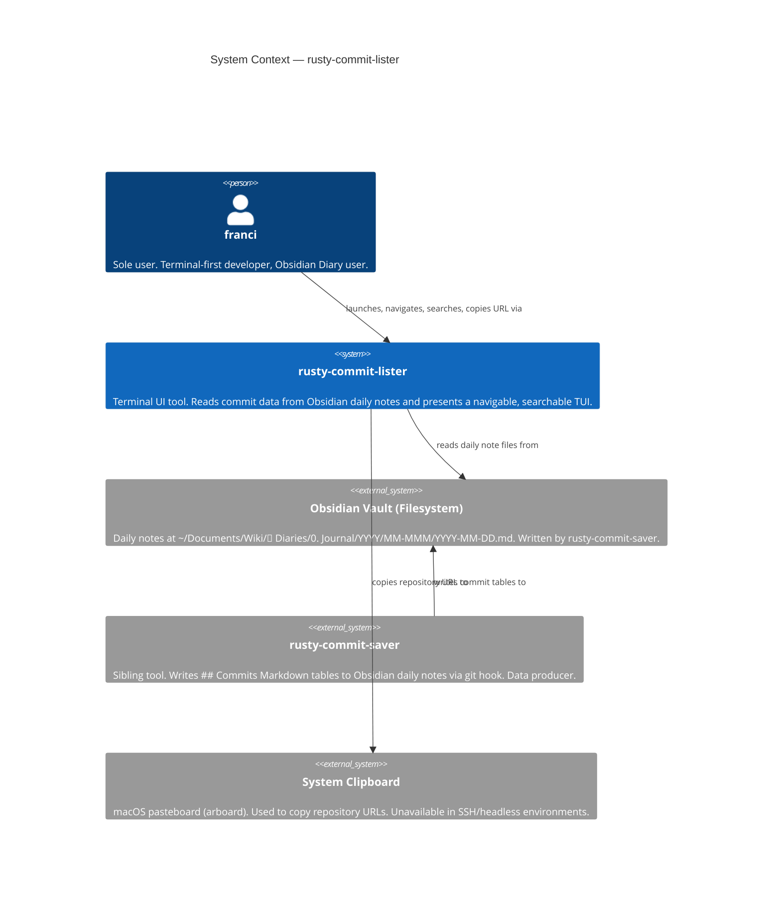
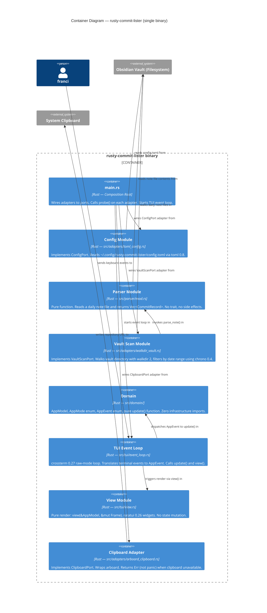
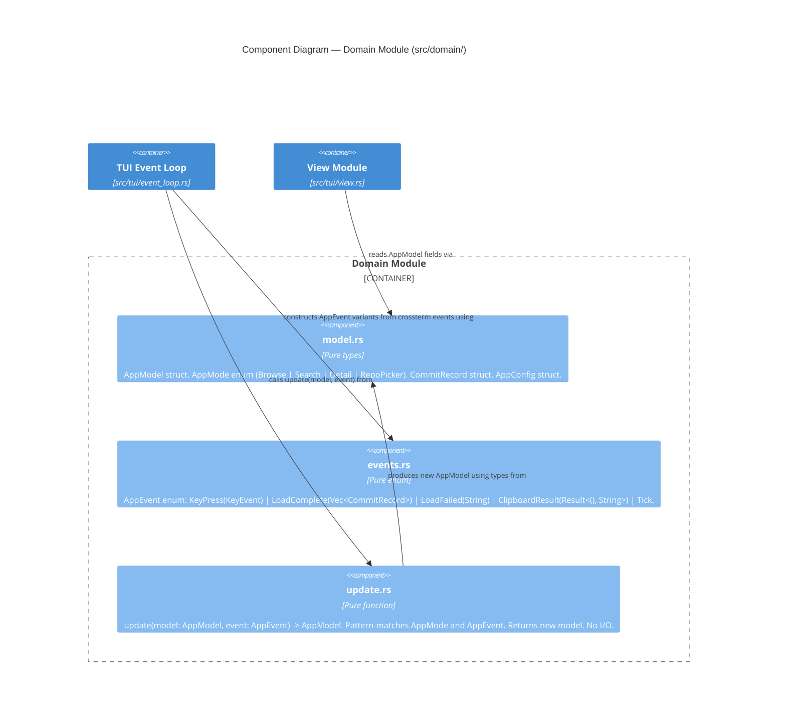

# Architecture Brief — rusty-commit-lister

**Date**: 2026-05-18
**Architect**: Morgan (Solution Architect — DESIGN wave)
**Status**: Approved — ready for DISTILL / acceptance-designer handoff

---

## System Architecture

> Section reserved for Titan (Platform Architect — DEVOPS wave).
> No infrastructure or CI/CD decisions have been made yet.

---

## Domain Model

> Section reserved for Hera (Domain Architect) if DDD tactical design is needed.
> Domain is simple enough that tactical DDD is not warranted for this personal tool.

---

## Application Architecture

### Overview

rusty-commit-lister is a terminal UI tool that reads structured commit data written by
rusty-commit-saver into Obsidian daily-note Markdown tables, and presents it as a navigable,
searchable, filterable ratatui TUI.

**Architecture pattern**: Modular Monolith with Ports-and-Adapters (Hexagonal)
**Development paradigm**: Functional Programming — Elm/MVU
**Deployment unit**: Single binary (cargo build --release)
**Team**: 1 (sole developer, sole user)

The Elm/MVU pattern maps directly onto ratatui's event loop:

```
Event → update(Model, Event) → Model → view(&Model, &mut Frame)
```

All domain logic is pure. Side effects (config load, vault scan, clipboard) are isolated to
adapters that are wired once at the composition root (`main.rs`) and never imported by domain
modules.

---

### C4 System Context Diagram (L1)



---

### C4 Container Diagram (L2)



---

### C4 Component Diagram (L3) — Domain Module

The domain module has 4 internal components and warrants an L3 diagram.



---

### Component Boundary Table

| Module | Path | Responsibility | I/O | Depends On |
|---|---|---|---|---|
| Composition Root | `src/main.rs` | Wire adapters to ports; probe each adapter; start event loop | CLI args (clap) → TUI run | All adapters, TUI event loop |
| Domain — Model | `src/domain/model.rs` | Pure types: AppModel, AppMode, CommitRecord, AppConfig | None | stdlib only |
| Domain — Events | `src/domain/events.rs` | AppEvent enum — all events that can drive state transitions | None | stdlib, crossterm KeyEvent |
| Domain — Update | `src/domain/update.rs` | Pure state machine: update(AppModel, AppEvent) → AppModel | None | domain/model, domain/events |
| Port — Config | `src/ports/config_port.rs` | Trait ConfigPort: load() → Result<AppConfig> | None | domain/model (AppConfig) |
| Port — Vault | `src/ports/vault_port.rs` | Trait VaultScanPort: scan(days_back) → Result<Vec<CommitRecord>> | None | domain/model (CommitRecord) |
| Port — Clipboard | `src/ports/clipboard_port.rs` | Trait ClipboardPort: write(text) → Result<()>; probe() → Result<()> | None | stdlib |
| Adapter — Config | `src/adapters/toml_config.rs` | TomlConfigAdapter implements ConfigPort. Reads TOML, expands ~, validates | Filesystem read | toml 0.8, ports/config_port |
| Adapter — Vault | `src/adapters/walkdir_vault.rs` | WalkdirScanAdapter implements VaultScanPort. Walks vault dir, calls parser | Filesystem read | walkdir 2, chrono 0.4, parser, ports/vault_port |
| Adapter — Clipboard | `src/adapters/arboard_clipboard.rs` | ArboardClipboardAdapter implements ClipboardPort. probe() verifies write/read | Clipboard write | arboard, ports/clipboard_port |
| Parser | `src/parser/mod.rs` | Pure function parse_note(path) → Vec<CommitRecord>. No trait. Skip-and-log on malformed rows | File contents (String) | chrono 0.4, domain/model |
| TUI — View | `src/tui/view.rs` | Pure render: view(&AppModel, &mut Frame). No mutation. Widgets per AppMode | Frame (ratatui) | ratatui 0.26, domain/model |
| TUI — Event Loop | `src/tui/event_loop.rs` | crossterm raw-mode loop. Translate KeyEvent → AppEvent. Drive update→view cycle | Terminal stdin/stdout | crossterm 0.27, ratatui 0.26, domain |
| Error | `src/error.rs` | Extended RustyCommitListerError enum. Variants for config, vault, clipboard, parse errors | None | thiserror 2.0 |

---

### Port Traits

#### ConfigPort

```
trait ConfigPort:
  fn load(&self) -> Result<AppConfig>
```

`AppConfig` contains: `vault_path: PathBuf`, `scan_days_back: u32`, `repo_filter: Option<String>`.
Config precedence (highest to lowest): CLI flags → env vars → config.toml → defaults.

#### VaultScanPort

```
trait VaultScanPort:
  fn scan(&self, days_back: u32) -> Result<Vec<CommitRecord>>
```

Returns all `CommitRecord` values from the scan window, sorted newest-first.
The adapter internally calls `parse_note()` for each discovered file.

#### ClipboardPort

```
trait ClipboardPort:
  fn write(&self, text: &str) -> Result<()>
  fn probe(&self) -> Result<()>
```

`probe()` must write a sentinel string and read it back, verifying round-trip.
On SSH/headless environments, `write()` returns `Err` (never panics).
The composition root calls `probe()` before starting the TUI. Clipboard probe failure is
**non-fatal** — it downgrades clipboard capability to unavailable; the system still starts.
This is the one adapter where a failing probe permits degraded operation (by design: US-08).

---

### Earned Trust — Probe Contracts

Every adapter that depends on an external substrate specifies an explicit probe contract.

| Adapter | Substrate | Lies to detect | Probe contract |
|---|---|---|---|
| TomlConfigAdapter | Filesystem + TOML parser | File exists but is not readable (permissions); ~ expansion returns wrong home dir; TOML parse succeeds but required keys absent | `probe()`: read config path; if absent, confirm defaults apply; if present, parse and validate required fields; return structured error on any failure |
| WalkdirScanAdapter | Filesystem (vault dir) | Vault path does not exist; vault path has wrong type (file, not dir); Unicode emoji segment causes OsString round-trip loss | `probe()`: verify vault_path exists and is a directory; open one file in the path; round-trip the emoji path segment via OsString and verify identity |
| ArboardClipboardAdapter | System clipboard / arboard | Clipboard API initialises but write silently no-ops (headless X11 fallback); read-back returns different string due to type coercion | `probe()`: write sentinel string "rcl-probe-sentinel"; read back immediately; assert string equality; on any error, return `ClipboardUnavailable` (non-fatal) |

**Composition root invariant**: wire → probe → use. Adapters that fail a fatal probe cause the
process to exit with a structured error message before the TUI starts. Clipboard probe failure
is non-fatal — it sets `AppConfig.clipboard_available = false`.

**Enforcement layers** (three semantically orthogonal):
1. Subtype check: `mypy`-equivalent = Rust trait bounds. `ClipboardPort: Probe` supertrait enforced at compile time. Any adapter missing `probe()` fails to compile.
2. Structural check: AST pre-commit hook (custom Rust script or `cargo check` with clippy lint) walks adapter source files and asserts presence of `fn probe` in each struct that implements a port trait.
3. Behavioral check: CI gold test runner (`cargo test --test probe_gold_tests`) exercises each adapter's probe against a real substrate (temp filesystem, temp clipboard where available).

---

### Technology Stack

| Crate | Version | License | Role | Rationale |
|---|---|---|---|---|
| ratatui | 0.26 | MIT | TUI framework | Actively maintained fork of tui-rs. Standard choice for Rust TUIs. 18k+ GitHub stars. |
| crossterm | 0.27 | MIT | Terminal backend + raw-mode events | ratatui's recommended backend. Cross-platform (macOS, Linux, Windows). |
| chrono | 0.4 | MIT/Apache-2.0 | Date arithmetic and parsing | De-facto standard Rust date library. Required for scan_days_back window calculation. |
| walkdir | 2 | MIT/Unlicense | Recursive filesystem traversal | Minimal, correct, zero unsafe. Used in WalkdirScanAdapter. |
| toml | 0.8 | MIT/Apache-2.0 | TOML config parsing | Supports serde derive; matches config.toml format used by rusty-commit-saver ecosystem. |
| clap | 4.5 | MIT/Apache-2.0 | CLI argument parsing (derive macro) | Already in Cargo.toml. Used only at composition root for flag parsing. |
| tokio | 1.48 | MIT | Async runtime | Already in Cargo.toml. Reserved for slice-05+ async load if startup > 100ms. Not used in slice-01/02 event loop. |
| serde | 1.0 | MIT/Apache-2.0 | Serialisation derive for CommitRecord | Already in Cargo.toml. Enables serde derive on domain types. |
| anyhow | 1.0 | MIT/Apache-2.0 | Error propagation in adapters and main | Already in Cargo.toml. Used at composition root and adapter boundaries. |
| thiserror | 2.0 | MIT/Apache-2.0 | Typed error enum (RustyCommitListerError) | Already in Cargo.toml. Used in error.rs for structured domain errors. |
| arboard | TBD (latest stable) | MIT/Apache-2.0 | Clipboard read/write | Cross-platform (macOS native pasteboard, X11/Wayland). Actively maintained. To be added in slice-05. Alternatives: `clipboard` crate (less maintained, rejected — see ADR-004). |

**Note on existing Cargo.toml**: `serde_json`, `serde_yaml`, `tracing`, `tracing-subscriber`,
and `config` are present from the bootstrap template. Only `tracing`/`tracing-subscriber` are
retained (debug logging for parser skip-and-log). `config`, `serde_json`, `serde_yaml` are not
needed for this feature — they should be removed when cleaning up the scaffold.

---

### Reuse Analysis

| Existing Component | Location | Status | Decision |
|---|---|---|---|
| `RustyCommitListerError` | `src/error.rs` | EXISTS — bootstrap scaffold | EXTEND: add `ParseError`, `VaultError`, `ClipboardUnavailable` variants |
| `RustyCommitLister` struct | `src/lib.rs` | EXISTS — bootstrap scaffold stub | REPLACE: the struct becomes the composition root responsibility in `main.rs`; lib.rs re-exports port traits and domain types |
| `main.rs` clap setup | `src/main.rs` | EXISTS — bootstrap scaffold | EXTEND: keep clap arg parsing; replace `run()` body with adapter wiring + probe + TUI start |
| `tokio` runtime | `Cargo.toml` | EXISTS | REUSE: retained for future async load; not actively used in slice-01/02 |
| `tracing` / `tracing-subscriber` | `Cargo.toml` | EXISTS | REUSE: used for debug/warn logs in parser skip-and-log |
| `serde` / `anyhow` / `thiserror` | `Cargo.toml` | EXISTS | REUSE: all three used directly |
| `clap` | `Cargo.toml` | EXISTS | REUSE: drives ConfigPort precedence (flags > env > config.toml) |
| ratatui, crossterm, chrono, walkdir, toml | `Cargo.toml` | EXISTS (already added) | REUSE: all present in the current Cargo.toml |
| `config` crate | `Cargo.toml` | EXISTS | REMOVE: superseded by direct `toml 0.8` parsing in TomlConfigAdapter |
| `serde_json`, `serde_yaml` | `Cargo.toml` | EXISTS | REMOVE: no JSON or YAML in this feature |
| `arboard` | `Cargo.toml` | ABSENT | ADD in slice-05 |

---

### Module Structure

```
src/
├── main.rs                      ← composition root: wire adapters → probe → run TUI
├── lib.rs                       ← re-export port traits and domain types for tests
├── error.rs                     ← extended RustyCommitListerError
├── domain/
│   ├── mod.rs
│   ├── model.rs                 ← AppModel, AppMode, CommitRecord, AppConfig (pure types)
│   ├── events.rs                ← AppEvent enum
│   └── update.rs                ← update(AppModel, AppEvent) -> AppModel (pure)
├── ports/
│   ├── mod.rs
│   ├── config_port.rs           ← trait ConfigPort (+ Probe supertrait)
│   ├── vault_port.rs            ← trait VaultScanPort (+ Probe supertrait)
│   └── clipboard_port.rs        ← trait ClipboardPort (+ Probe supertrait)
├── adapters/
│   ├── mod.rs
│   ├── toml_config.rs           ← TomlConfigAdapter: ConfigPort + probe()
│   ├── walkdir_vault.rs         ← WalkdirScanAdapter: VaultScanPort + probe()
│   └── arboard_clipboard.rs     ← ArboardClipboardAdapter: ClipboardPort + probe()
├── parser/
│   └── mod.rs                   ← parse_note(path: &Path) -> Vec<CommitRecord> (pure)
├── tui/
│   ├── mod.rs
│   ├── view.rs                  ← view(&AppModel, &mut Frame) (pure render)
│   └── event_loop.rs            ← crossterm event loop; drives update() + view()
```

---

### Integration Patterns

**Config load (sync, once at startup)**:
`main.rs` calls `ConfigPort::load()` synchronously before starting the TUI. Config errors are
fatal (exit code 2). This is a deliberate design choice — see ADR-002 for async load rationale.

**Vault scan (sync, blocking in slice-01/02)**:
`main.rs` calls `VaultScanPort::scan()` synchronously. The result is packaged as a
`LoadComplete(Vec<CommitRecord>)` event and passed to `update()` to seed the initial model.
A `LoadFailed(String)` event is passed if scan fails — the TUI renders an error state, no crash.

**TUI event loop (sync, tick-driven)**:
`crossterm::event::poll` with 250ms timeout drives the loop. Each keyboard event is translated
to an `AppEvent` and dispatched to `update()`. The returned model is passed to `view()`.
No shared mutable state — the model is owned by the event loop and passed through update.

**Clipboard write (sync, in-loop)**:
When `c` is pressed in Detail mode, the event loop calls `ClipboardPort::write()` directly.
The result is packaged as `ClipboardResult(Ok(()))` or `ClipboardResult(Err(msg))` and passed
to `update()`, which sets the model's confirmation/fallback display state.

**Async upgrade path (slice-05+)**:
If vault scan exceeds 100ms on real data, the scan is moved to a `tokio::task::spawn_blocking`
call. The task sends `LoadComplete` / `LoadFailed` events to the TUI via an `mpsc::channel`.
The event loop polls the channel on each tick. This is the only async path; the domain update
function does not change — only the adapter wiring changes.

---

### Quality Attribute Strategies

#### Performance
- Startup < 2s for scan_days_back ≤ 30: enforced by sync blocking load (30 files × < 1ms parse = < 50ms). Loading indicator rendered within 100ms by showing spinner before scan starts.
- TUI rendering: ratatui double-buffer reduces redraw to changed regions. View is pure — no allocation per render beyond ratatui's own buffers.
- Search filtering: in-memory substring filter on `Vec<CommitRecord>`; no re-parse on keypress.

#### Reliability
- Skip-and-log: parser never panics on malformed input (property test in slice-01).
- Clipboard failure is non-fatal: degrades to text display per US-08.
- Vault path missing: `VaultScanPort::probe()` catches this before TUI starts; structured error message with actionable guidance.
- Alt screen + raw mode always restored: cleanup via `Drop` impl on event loop struct, and SIGINT handler registered at startup.

#### Maintainability
- Pure domain: `update()` is a pure function. State machine tests need no setup or mocks.
- Dependency direction: domain has zero imports from adapters or TUI. Enforced by `cargo-deny` or `dependency-cruiser` rule (see Enforcement section below).
- Single-file parser: `parse_note()` is a pure function with no trait — trivially replaceable if rusty-commit-saver changes its format.

#### Testability
- Domain unit tests: `update(model, event)` tests are pure-function calls. No async, no I/O, no setup.
- Parser unit tests: `parse_note(path)` against fixture files (real Obsidian note samples).
- Adapter integration tests: each adapter tested against real filesystem/clipboard in isolated `tempfile` environments.
- Probe gold tests: CI runner exercises `probe()` on each adapter with fault-injection scenarios (missing vault dir, unreadable file, clipboard unavailable).

#### Security
- No secrets in config; vault_path is not sensitive.
- No network I/O — the tool is fully offline.
- No `unsafe` code; enforced by `#![forbid(unsafe_code)]` at crate root.

---

### Architectural Enforcement Tooling

| Rule | Tool | Enforcement point |
|---|---|---|
| Domain has no imports from adapters or TUI | `dependency-cruiser` (JS/TS) equivalent: Rust — custom `cargo check` + clippy lint OR `cargo-modules` graph inspection | Pre-commit hook + CI |
| Every adapter struct implements `probe()` | Compile-time: `Probe` supertrait on each port trait | `cargo build` |
| No `unsafe` code | `#![forbid(unsafe_code)]` in `main.rs` and `lib.rs` | `cargo build` |
| Structural probe presence | AST pre-commit hook: verify `fn probe` in each file under `src/adapters/` | Pre-commit hook |
| Behavioral probe correctness | `cargo test --test probe_gold_tests` | CI |

---

### ADR Index

| ADR | Title | Status |
|---|---|---|
| ADR-001 | TUI Architecture: Elm/MVU vs Mutable App Struct | Accepted |
| ADR-002 | Async Loading Strategy | Accepted |
| ADR-003 | Development Paradigm: FP vs OOP for Rust | Accepted |
| ADR-004 | Clipboard Integration: arboard vs clipboard vs fallback | Accepted |

---

### Handoff Notes for Platform Architect (DEVOPS wave)

- Single binary; `cargo build --release` produces the deployable artifact.
- No external services, no network I/O — no container orchestration needed.
- Distribution: `cargo-dist` already configured in Cargo.toml for GitHub Releases.
- Targets: `aarch64-apple-darwin`, `x86_64-apple-darwin`, `x86_64-unknown-linux-gnu`, `x86_64-pc-windows-msvc`.
- Development paradigm: **Functional Programming** — direct `/nw-develop` to use `@nw-functional-software-crafter`.
- No external integrations requiring contract tests (rusty-commit-saver communicates only via filesystem; no API boundary).
- Probe gold tests must run in CI before acceptance tests.
